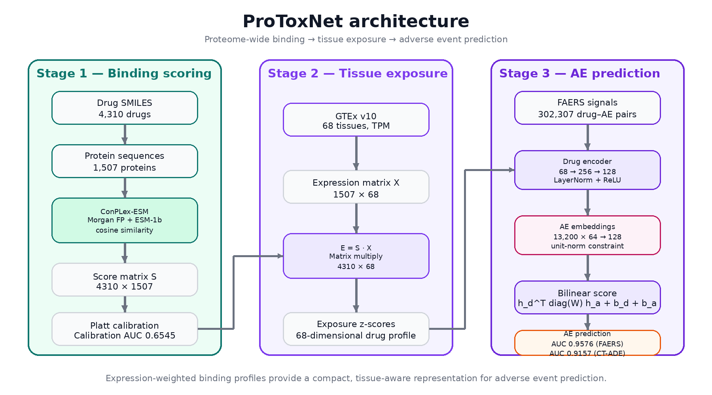

# ProToxNet

**ProToxNet** is a tissue-aware adverse event prediction framework that integrates proteome-wide predicted drug–protein binding with tissue-specific expression to predict drug–adverse event associations in a biologically grounded way.

This repository contains the end-to-end pipeline used to construct expression-weighted drug exposure profiles, train the bilinear adverse event model, run external validation, and reproduce evaluation analyses.

## Overview

Conventional computational drug safety methods often treat toxicity as either a property of molecular structure alone or a pattern mined from pharmacovigilance reports. ProToxNet instead models adverse event risk as a joint function of:

1. **Proteome-wide drug binding propensity**
2. **Tissue-specific target expression**
3. **Drug–adverse event interaction learning**

In the manuscript, this approach yields:

- **FAERS pair-level AUC:** 0.9576
- **Leave-drug-out cold-start AUC:** 0.8544
- **Leave-AE-out AUC:** 0.8472
- **CT-ADE external validation AUC:** 0.9157

## Architecture



The pipeline has three main stages:

- **Stage 1 — Binding scoring:** proteome-wide drug–protein scores are computed using a ConPLex/ESM-based setup.
- **Stage 2 — Tissue exposure:** binding scores are weighted by tissue expression to create a 68-dimensional tissue exposure profile per drug.
- **Stage 3 — AE prediction:** a diagonal bilinear model learns drug–adverse event associations from FAERS-derived signals.

## Repository structure

```text
ProToxNet/
├── README.md
├── requirements.txt
├── .gitignore
├── run.py
├── assets/
│   └── protoxnet.png
├── pipeline/
│   ├── __init__.py
│   ├── step1_data.py
│   ├── step2_conplex.py
│   ├── step3_exposure.py
│   ├── step4_train.py
│   ├── step5_ctade.py
│   └── step6_figures.py
├── eval/
│   ├── __init__.py
│   ├── eval_ldo.py
│   ├── eval_lao.py
│   ├── eval_dilirank.py
│   ├── eval_baselines.py
│   ├── eval_ablation.py
│   ├── eval_dti_sensitivity.py
│   ├── eval_bootstrap_ci.py
│   └── eval_ctade_per_drug.py
└── data/
    ├── .gitkeep
    └── README.md
```

## Installation

Clone the repository:

```bash
git clone https://github.com/vaibhavalakshmiravideshik/ProToxNet.git
cd ProToxNet
```

Install dependencies:

```bash
pip install -r requirements.txt
```

## Quick start

Run the full pipeline:

```bash
python run.py
```

Run selected pipeline stages:

```bash
python run.py --steps 1 2 3
python run.py --steps 4 5 6
```

Run evaluation scripts only:

```bash
python run.py --eval ldo lao
python run.py --eval all
```

Use a custom runtime data directory:

```bash
python run.py --drive /path/to/data
python run.py --drive /path/to/data --steps 1 2 3
```

By default, runtime outputs are written to [`data/`](data/).

## Pipeline stages

### Step 1 — Data acquisition

[`pipeline/step1_data.py`](pipeline/step1_data.py) downloads or prepares the core datasets used by ProToxNet, including DrugCentral-derived interactions, FAERS-derived signals, STRING protein interactions, CT-ADE, and identifier maps.

### Step 2 — Proteome-wide binding scoring

[`pipeline/step2_conplex.py`](pipeline/step2_conplex.py) computes drug–protein scores using a ConPLex-style model with Morgan fingerprints and ESM-1b protein embeddings, then performs Platt calibration.

### Step 3 — Tissue exposure computation

[`pipeline/step3_exposure.py`](pipeline/step3_exposure.py) computes expression-weighted tissue exposure:

```math
E = S \cdot X
```

where `S` is the drug–protein score matrix and `X` is the protein–tissue expression matrix.

### Step 4 — Bilinear model training

[`pipeline/step4_train.py`](pipeline/step4_train.py) trains the diagonal bilinear drug–AE prediction model on FAERS-derived positive pairs with negative sampling.

### Step 5 — CT-ADE external validation

[`pipeline/step5_ctade.py`](pipeline/step5_ctade.py) maps CT-ADE terms to the internal MedDRA vocabulary and evaluates the trained model externally.

### Step 6 — Figure generation

[`pipeline/step6_figures.py`](pipeline/step6_figures.py) generates manuscript figures and summary outputs from saved artifacts.

## Evaluation scripts

The [`eval/`](eval/) directory contains standalone analyses used in the paper:

- [`eval/eval_ldo.py`](eval/eval_ldo.py): leave-drug-out cold-start evaluation
- [`eval/eval_lao.py`](eval/eval_lao.py): leave-adverse-event-out evaluation
- [`eval/eval_dilirank.py`](eval/eval_dilirank.py): DILIrank liver exposure validation
- [`eval/eval_baselines.py`](eval/eval_baselines.py): fair baseline comparisons
- [`eval/eval_ablation.py`](eval/eval_ablation.py): ablation experiments
- [`eval/eval_dti_sensitivity.py`](eval/eval_dti_sensitivity.py): sensitivity to DTI-derived features
- [`eval/eval_bootstrap_ci.py`](eval/eval_bootstrap_ci.py): bootstrap confidence intervals
- [`eval/eval_ctade_per_drug.py`](eval/eval_ctade_per_drug.py): per-trial-arm CT-ADE analysis

## Data sources

ProToxNet uses publicly available biomedical datasets and tools, including:

- [DrugCentral](https://drugcentral.org/)
- [GTEx Portal](https://gtexportal.org/home/)
- [STRING](https://string-db.org/)
- [CT-ADE on Figshare](https://figshare.com/articles/dataset/28142453)
- [ConPLex](https://github.com/samsledje/ConPLex)
- [UniProt](https://www.uniprot.org/)
- [ChEMBL](https://www.ebi.ac.uk/chembl/)

Expected runtime files and output layout are documented in [`data/README.md`](data/README.md).

## Main outputs

Depending on which stages are run, the repository produces:

- calibrated drug–protein score matrices
- tissue exposure matrices
- trained bilinear model checkpoints
- CT-ADE remapped predictions
- baseline, ablation, and bootstrap summaries
- manuscript-ready figures

## Manuscript context

This repository accompanies the manuscript:

> **ProToxNet: Expression-Aware Proteome-Wide Binding for Tissue-Stratified Adverse Event Prediction**  
> Vaibhava Lakshmi Ravideshik

Key claims supported in the manuscript include:

- strong held-out FAERS performance
- generalization to unseen drugs and unseen adverse events
- external validation on CT-ADE
- biologically interpretable liver exposure enrichment in hepatotoxic drugs
- recovery of known adverse events for approved kinase inhibitors

## Reproducibility notes

- Scripts are designed to run from the repository root.
- `run.py` is the main orchestration entry point.
- Large raw data files, checkpoints, matrices, and generated outputs are intentionally not versioned.
- Some pipeline steps require substantial compute and storage, especially proteome-wide scoring.

## Citation

If you use this repository, please cite the associated manuscript once available. Until then, please reference the repository directly:

```bibtex
@misc{ravideshik2026protoxnet,
  author       = {Ravideshik, Vaibhava Lakshmi},
  title        = {ProToxNet},
  year         = {2026},
  publisher    = {GitHub},
  howpublished = {\url{https://github.com/vaibhavalakshmiravideshik/ProToxNet}}
}
```

## Author

**Vaibhava Lakshmi Ravideshik**  
Email: [vlds@umich.edu](mailto:vlds@umich.edu)
